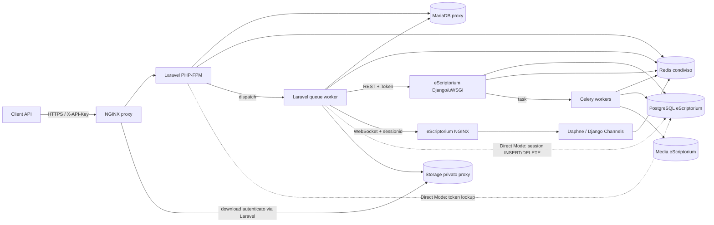
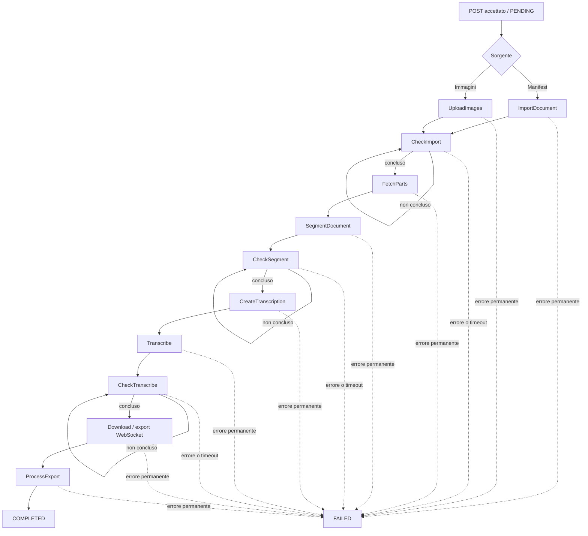
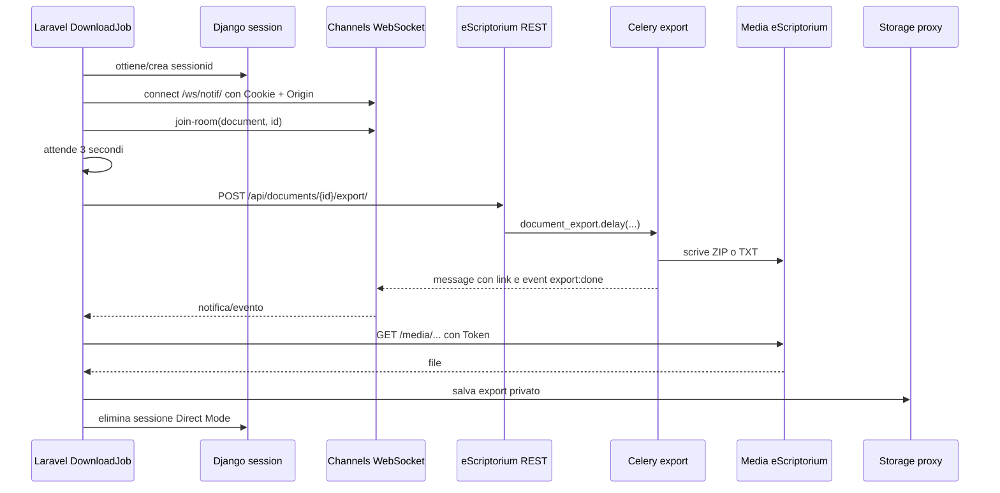
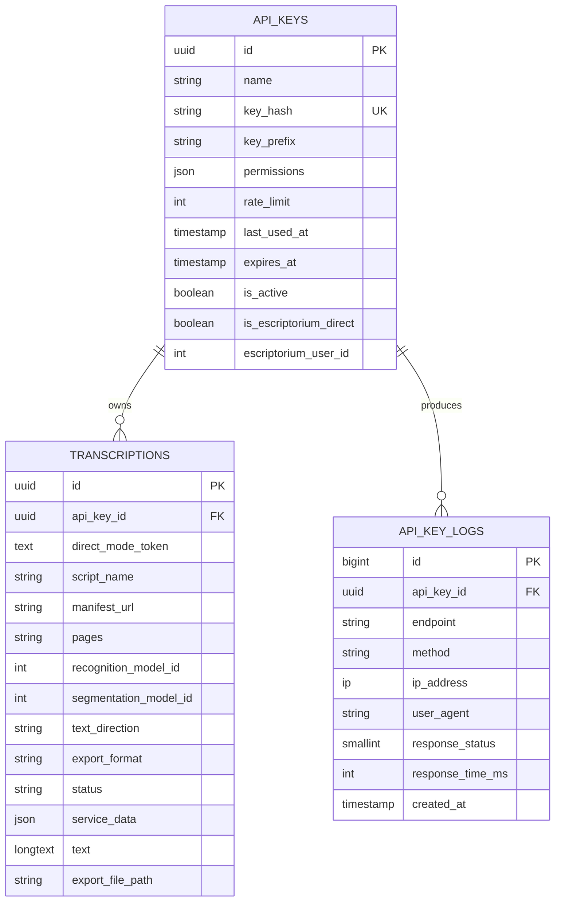

# Architettura e funzionamento del proxy Laravel per eScriptorium

> Analisi dello stato corrente del branch `stage`, commit `65f62429e8ae3f077de222d016a89b5f11d25a1e`.
> Il codice eScriptorium usato dai compose personalizzati è il submodule `escriptorium/` al commit `a966304caa9efb69c89cde81b7839de294bd1b4b`.

## 1. Sintesi

L'applicazione in `proxy/` non è un reverse proxy trasparente. È una **facciata applicativa stateful e un orchestratore asincrono** che espone una piccola API REST e traduce una singola richiesta di trascrizione in una sequenza di operazioni eScriptorium:

1. autentica il chiamante;
2. crea o riusa le risorse remote;
3. importa un manifest IIIF oppure carica immagini;
4. attende import, segmentazione e riconoscimento;
5. crea il livello di trascrizione;
6. avvia l'export;
7. attende l'esito via WebSocket;
8. scarica e conserva localmente il risultato;
9. esegue il post-processing;
10. elimina le risorse temporanee in Service Mode.

Il client vede quindi un contratto molto più semplice:

- un `POST` per avviare il lavoro;
- uno o più `GET` per leggerne lo stato;
- un `GET` opzionale per scaricare l'export.

Il proxy mantiene stato durevole in MariaDB, usa Redis per cache e queue, comunica con eScriptorium tramite REST, WebSocket e, in Direct Mode, anche tramite accesso diretto al PostgreSQL di Django.

## 2. Perimetro e fonti analizzate

Questa descrizione deriva dal comportamento del codice, usato come fonte primaria, e dal confronto con tutta la documentazione Markdown di prima parte presente nel repository.

### 2.1 Documentazione letta

- `README.md`
- `CLAUDE.md`
- `DOCKER.md`
- `INSTALL-ubuntu.md`
- `ESCRIPTORIUM_APPLICATION_FLOW.md`
- `ESCRIPTORIUM_API_DOCUMENT_PROCESSING.md`
- `app/apps/imports/README.md`
- `proxy/README.md`
- `proxy/docs/api-keys.md`
- `proxy/app/Services/API_DOCUMENTATION.md`
- `escriptorium/README.md`
- `escriptorium/INSTALL-ubuntu.md`
- `escriptorium/app/apps/imports/README.md`

### 2.2 Codice considerato

Sono stati verificati:

- bootstrap, route, controller, request validation e middleware Laravel;
- service, facade, contesto di autenticazione e gestione delle sessioni Django;
- modelli, enum, migrazioni e comandi Artisan;
- tutti i job della pipeline e il relativo service-data manager;
- configurazioni di database, cache, queue, storage, CORS, logging e OpenAPI;
- frontend React/Inertia della console di debug;
- Dockerfile, entrypoint, Nginx, Makefile, script di setup e i tre compose applicativi;
- i punti d'integrazione Django/DRF, Celery e Channels del submodule eScriptorium.

Il documento integra queste fonti in una descrizione unitaria dell'architettura, dei flussi applicativi e delle modalità operative del proxy.

## 3. Struttura del repository

Nel repository convivono tre blocchi distinti:

| Percorso | Ruolo |
|---|---|
| `proxy/` | Applicazione Laravel 12 che espone la facade REST e orchestra il workflow |
| `escriptorium/` | Submodule eScriptorium Django effettivamente costruito dai compose `development`, `staging` e `production` |
| `app/`, `front/`, `docker-compose.yml` | Albero e compose upstream eScriptorium presenti nella radice; costituiscono uno stack separato rispetto ai compose personalizzati |

I file `docker-compose.development.yml`, `docker-compose.staging.yml` e `docker-compose.production.yml` sono lo stack integrato proxy + eScriptorium. Il file `docker-compose.yml` nella radice è invece il compose upstream eScriptorium e non avvia il proxy Laravel.

## 4. Vista architetturale



### 4.1 Componenti principali

| Componente | Responsabilità |
|---|---|
| Nginx del proxy | Espone Laravel, serve asset statici e inoltra PHP a FPM; non inoltra le API eScriptorium ai client |
| Laravel PHP-FPM | API sincrona, autenticazione, validazione, persistenza del processo, status e download |
| Laravel queue worker | Esegue l'orchestrazione lunga come catena di job indipendenti |
| MariaDB | Stato locale del proxy: chiavi, trascrizioni, log opzionali, failed jobs e tabelle Laravel |
| Redis | Queue, cache, rate limiter e sessioni Laravel; nello stack è condiviso anche con Celery, cache Django e Channels |
| eScriptorium web | API Django REST e pagine necessarie al login di sessione |
| Celery eScriptorium | Import, segmentazione, riconoscimento ed export effettivi |
| eScriptorium WebSocket | Notifiche utente ed eventi associati alla room del documento |
| PostgreSQL eScriptorium | Dati nativi di eScriptorium; consultato e modificato direttamente dal proxy in alcuni flussi |
| Storage proxy | Upload temporanei e copia durevole degli export |

## 5. Confini del proxy

Il proxy non esegue OCR o layout analysis. Queste attività restano responsabilità di Kraken/eScriptorium e dei worker Celery. Laravel si occupa di:

- tradurre il contratto REST semplificato nel contratto eScriptorium;
- mantenere la correlazione tra UUID locale e identificativi remoti;
- serializzare il workflow tramite job;
- applicare ownership, permessi e rate limiting;
- rendere uniforme l'output;
- conservare una copia dell'export indipendente dalla vita del progetto remoto.

Non esiste un inoltro generico di path, header e body. Ogni chiamata remota è costruita esplicitamente da `eScriptoriumService`.

## 6. API pubblica

Tutte le route applicative sono sotto `/api/v1` e richiedono `X-API-Key`.

| Metodo e path | Permesso | Funzione |
|---|---|---|
| `GET /api/v1/up` | `up` | Verifica che la base URL eScriptorium risponda; `204` oppure `503` |
| `GET /api/v1/models` | `models` | Legge i modelli visibili all'identità corrente e normalizza il risultato |
| `GET /api/v1/scripts` | `scripts` | Restituisce gli script eScriptorium |
| `POST /api/v1/process/manifest` | `process` | Avvia il workflow da manifest IIIF |
| `POST /api/v1/process/images` | `process` | Avvia il workflow da upload multipart |
| `GET /api/v1/process/{id}` | `process` | Restituisce stato, formato, testo e, quando disponibile, URL di download |
| `GET /api/v1/process/{id}/download` | `process` | Serve il file privato ZIP/TXT appartenente alla chiave corrente |

### 6.1 Contratto asincrono

I due endpoint di avvio restituiscono `201` con un UUID locale:

```json
{
  "message": "Process started successfully",
  "transcription_id": "<uuid>",
  "status": 201
}
```

Il client interroga poi `GET /api/v1/process/{uuid}`. Lo status pubblico è uno tra:

```text
PENDING -> IMPORTING -> SEGMENTING -> TRANSCRIBING
        -> DOWNLOADING -> PROCESSING -> COMPLETED
```

Un errore permanente porta a `FAILED`. Gli step interni `fetch_parts` e `create_transcription` non hanno uno status pubblico dedicato.

### 6.2 Ownership

Status e download cercano sempre la trascrizione usando contemporaneamente:

- UUID della trascrizione;
- `api_key_id` associato alla richiesta autenticata.

Una chiave non può quindi leggere il lavoro di un'altra chiave, anche conoscendone l'UUID. In Direct Mode l'ownership è per utente eScriptorium, perché tutti i token dello stesso utente convergono sulla stessa API key virtuale locale.

## 7. Autenticazione duale

Il middleware `ValidateApiKey` interpreta lo stesso header in due modi.

### 7.1 Service Mode: chiave gestita dal proxy

Una chiave generata dal proxy ha formato `esk_...`.

1. Laravel cerca comunque prima il valore in `authtoken_token` su PostgreSQL.
2. Se non lo trova, calcola SHA-256 e cerca `api_keys.key_hash` in MariaDB.
3. Verifica flag attivo, scadenza e permesso richiesto.
4. Imposta `ApiContext` in Service Mode.
5. Le chiamate eScriptorium usano il token dell'account di servizio.

Il token remoto viene ottenuto con `POST /api/token-auth/` usando `ESCRIPTORIUM_USERNAME` e `ESCRIPTORIUM_PASSWORD`, poi memorizzato in cache per 12 ore per impostazione predefinita. I valori di fallback sono `admin`/`admin`.

Le chiavi proxy sono salvate solo come hash; il valore in chiaro viene mostrato una volta dal comando di generazione. Permessi vuoti o `*` equivalgono ad accesso completo. I permessi granulari usati dalle route sono `up`, `models`, `scripts` e `process`.

In questa modalità progetto e documento remoti sono temporanei. Il progetto viene eliminato dopo che l'export è stato scaricato con successo; l'esito dell'operazione viene registrato nei log senza modificare il risultato locale già acquisito.

### 7.2 Direct Mode: token eScriptorium dell'utente

Se il valore di `X-API-Key` esiste nella tabella Django REST Framework `authtoken_token`, il proxy entra in Direct Mode.

1. Il token viene validato direttamente in PostgreSQL.
2. Laravel crea o riusa una `ApiKey` virtuale identificata da `escriptorium_user_id`.
3. La chiave virtuale ha permessi `*` e rate limit predefinito 1000/minuto.
4. Le richieste REST remote usano direttamente il token del client.
5. Il token viene conservato nella trascrizione con cast Laravel `encrypted`, così ogni job successivo può ricostruire l'identità.
6. Progetto e documento eScriptorium non vengono eliminati.

La chiave virtuale è per **utente**, non per token. Se un utente rigenera il proprio token eScriptorium, il nuovo token continua ad accedere alle trascrizioni locali già associate allo stesso utente.

### 7.3 Contesto di autenticazione nei processi lunghi

`ApiContext` è statico al processo PHP. Nelle request HTTP viene resettato dal middleware terminable `ResetApiContext`. Ogni job usa `UsesEscriptoriumAuth`, legge `direct_mode_token` dalla trascrizione e imposta il contesto prima di chiamare il service.

I worker sono long-lived. I job reimpostano il contesto in ingresso e i metodi `failed()` ne eseguono il reset esplicito, mantenendo separata l'identità associata a ogni trascrizione.

### 7.4 Rate limiting e logging

Il rate limiter usa la chiave `api_key:{uuid}`, una finestra di 60 secondi e il limite memorizzato sul record `api_keys`. Ogni richiesta aggiorna `last_used_at`. Il log dettagliato in `api_key_logs` è opzionale e disabilitato per impostazione predefinita. I sottogruppi di route associano inoltre il permesso richiesto alle singole operazioni (`up`, `models`, `scripts` o `process`).

## 8. Creazione di un processo

### 8.1 Validazione comune

Entrambi i `POST` richiedono:

- `script_id`, intero;
- `recognition_model_id`, intero;
- `segmentation_model_id`, intero opzionale;
- `text_direction`, salvo quando è fornito `document_id`;
- `export_format`, opzionale e predefinito a `teixml`.

Le direzioni ammesse sono:

- `horizontal-lr`
- `horizontal-rl`
- `vertical-lr`
- `vertical-rl`
- `ttb`

I formati ammessi sono:

- `teixml`
- `text`
- `pagexml`
- `alto`
- `openitimarkdown`

Dopo la validazione sintattica, la request interroga `/api/scripts/` e traduce `script_id` nel nome richiesto da eScriptorium per creare il documento. La risoluzione degli ID dei modelli e la loro compatibilità con l'operazione richiesta sono demandate a eScriptorium.

### 8.2 Sorgente manifest IIIF

Parametri specifici:

- `manifest_url`: URL obbligatorio;
- `pages`: stringa opzionale come `1-5,8,10-12`.

La regola `PagesRange` impedisce separatori errati, range discendenti e duplicati. Se `pages` manca, il proxy seleziona per default le pagine 1–10, non l'intero manifest. La numerazione pubblica è 1-based e viene convertita nel campo remoto `order`, che è 0-based.

### 8.3 Sorgente immagini

Parametri specifici:

- `images`: array multipart con almeno un file;
- massimo 20 MiB per file tramite la regola Laravel `image`.

La validazione dei formati è affidata al validator Laravel `image`; Nginx consente un body complessivo fino a 1 GiB.

Ogni file viene prima scritto nello storage privato sotto `transcriptions/pending_uploads`. Il worker lo legge, lo invia come multipart a eScriptorium e lo elimina dopo l'upload riuscito. Per questo flusso le pagine selezionate sono sempre tutte quelle caricate.

### 8.4 Nuovo documento o documento esistente

Il riuso tramite `document_id` è implementato solo quando il chiamante è in Direct Mode.

- Con `document_id`, il proxy esegue `GET /api/documents/{id}/`, usa il documento se accessibile e ricava la direzione dal suo `main_script`; in fallback converte `read_direction` in `horizontal-lr` o `horizontal-rl`.
- Senza `document_id`, crea un progetto e un documento con nomi casuali di 16 caratteri.
- In Service Mode un eventuale `document_id` non attiva il riuso: viene creato un nuovo progetto/documento.

Il riuso avviene tramite ID esplicito. Import o upload vengono applicati al documento selezionato e la segmentazione successiva usa `override=true`.

### 8.5 Persistenza e dispatch

La creazione di progetto e documento remoto è coordinata con una transazione MariaDB che salva la `Transcription` locale. Il primo job della pipeline viene inviato dopo il commit del record locale.

La trascrizione viene inizializzata con:

- UUID locale;
- proprietario `api_key_id`;
- token Direct Mode cifrato, se presente;
- input normalizzato;
- progetto e documento remoti;
- nome casuale del livello di trascrizione;
- stato `pending`;
- formato di export.

Dopo il commit viene inviato il primo job:

- `eScriptoriumImportDocumentJob` per il manifest;
- `eScriptoriumUploadImagesJob` per gli upload.

## 9. Pipeline asincrona



### 9.1 Sequenza dei job

| # | Job | Stato pubblico | Operazione |
|---:|---|---|---|
| 1a | `eScriptoriumImportDocumentJob` | `IMPORTING` | Avvia l'import IIIF e salva la risposta iniziale |
| 1b | `eScriptoriumUploadImagesJob` | `IMPORTING` | Carica una parte per immagine e rimuove i temporanei riusciti |
| 2 | `eScriptoriumCheckImportDocumentJob` | `IMPORTING` | Controlla il task di import o lo stato `convert` delle parti |
| 3 | `eScriptoriumFetchPartsJob` | `IMPORTING` | Legge fino a 5000 parti, seleziona le pagine richieste e salva i PK |
| 4 | `eScriptoriumSegmentDocumentJob` | `SEGMENTING` | Avvia segmentazione layout e baseline sulle parti selezionate |
| 5 | `eScriptoriumCheckSegmentDocumentJob` | `SEGMENTING` | Attende i task `core.tasks.segment` |
| 6 | `eScriptoriumCreateTranscriptionJob` | `SEGMENTING` | Crea sincronicamente il livello di trascrizione remoto |
| 7 | `eScriptoriumTranscribeTranscriptionJob` | `TRANSCRIBING` | Avvia il riconoscimento con modello e livello scelti |
| 8 | `eScriptoriumCheckTranscribeTranscriptionJob` | `TRANSCRIBING` | Attende i task `core.tasks.transcribe` |
| 9 | `eScriptoriumDownloadJob` | `DOWNLOADING` | Avvia export, attende WebSocket, scarica e conserva il file |
| 10 | `eScriptoriumProcessExportJob` | `PROCESSING` | Valida o post-processa l'output e porta il record a `COMPLETED` |

### 9.2 Import

Per il manifest il proxy invia modalità `iiif`, URI e nome. eScriptorium crea un `DocumentImport` e delega a Celery `imports.tasks.document_import`.

Il polling del manifest identifica il task `imports.tasks.document_import` e ne interpreta lo stato. Per le immagini il proxy controlla direttamente le parti e considera ancora in corso quelle con workflow `convert=ongoing`.

Al completamento viene richiesta la lista delle parti con `page_size=5000`. Per ogni numero pagina richiesto viene cercata una parte con `order = pagina - 1`; i PK risultanti diventano il perimetro di segmentazione, trascrizione ed export.

### 9.3 Segmentazione

Il proxy invia:

- `parts`: PK selezionati;
- `steps`: `both`;
- `override`: `true`;
- `text_direction`;
- modello di segmentazione opzionale.

Il polling legge i task del documento e seleziona quelli con metodo esatto `core.tasks.segment`. Stati queued/running provocano un nuovo poll; failed/canceled portano al fallimento; tutti gli altri stati terminali vengono considerati conclusi.

### 9.4 Livello di trascrizione e riconoscimento

Terminata la segmentazione, il proxy crea un livello con nome casuale. Poi avvia il riconoscimento fornendo:

- modello di riconoscimento;
- PK del livello;
- parti selezionate.

Il polling è analogo a quello della segmentazione, ma filtra `core.tasks.transcribe`.

### 9.5 Polling, retry e backoff

Il polling non blocca un worker con `sleep`: ogni controllo non conclusivo invia un nuovo job con delay, per default 30 secondi.

| Fase | Tentativi massimi di polling | Orizzonte nominale con intervallo 30 s |
|---|---:|---:|
| Import | 120 | circa 60 minuti |
| Segmentazione | 240 | circa 120 minuti |
| Trascrizione | 360 | circa 180 minuti |

L'orizzonte è indicativo e non include durata delle chiamate, retry tecnici o ritardi della queue.

Ogni polling job ha inoltre fino a 3 tentativi Laravel con backoff 10/30/60 secondi. I job operativi usano normalmente 3 tentativi con backoff 30/60/120. “Tentativo del job” e “tentativo di polling” sono contatori diversi.

Il manager scarta i poll obsoleti quando lo step è già terminale o quando il numero del poll è minore o uguale all'ultimo registrato. Gli avanzamenti vengono consolidati nel JSON `service_data` attraverso il data manager condiviso dai job.

## 10. Export, WebSocket e download

L'export è la parte più articolata perché l'API eScriptorium risponde subito `status=ok`, mentre il file viene generato da Celery in seguito.



### 10.1 Autenticazione WebSocket in Service Mode

Il token DRF non autentica Django Channels, che usa `AuthMiddlewareStack` e quindi una sessione Django.

In Service Mode il service:

1. carica `/login/`;
2. estrae `csrftoken` dal cookie o dall'HTML;
3. esegue il login form con l'account di servizio;
4. usa il cookie `sessionid` nell'handshake WebSocket.

Il consumer aggiunge il socket sia al gruppo notifiche dell'utente sia, dopo `join-room`, alla room del documento. Il proxy accetta la notifica di tipo `message` contenente “Export done” e legge il primo link.

### 10.2 Autenticazione WebSocket in Direct Mode

In Direct Mode il proxy non dispone della password utente. `DjangoSessionService`:

1. legge utente e hash password tramite `authtoken_token` + `users_user`;
2. costruisce `_auth_user_id`, backend e `_auth_user_hash` compatibili con Django;
3. codifica e firma la sessione con `ESCRIPTORIUM_DJANGO_SECRET_KEY`;
4. inserisce una riga in `django_session` con scadenza a 14 giorni;
5. restituisce il `sessionid` al client WebSocket;
6. elimina la riga nel `finally` del job.

Alla ricezione di `event: export:done`, il proxy ricava l'utente corrente via REST e costruisce il path media previsto:

```text
/media/users/{user_pk}/{document_name}_export.{zip|txt}
```

Il codice gestisce i segnali di errore `export:error` e `import:error` emessi durante l'elaborazione dell'export.

Questo flusso usa l'accesso PostgreSQL in scrittura e la stessa `SECRET_KEY` configurata in Django.

### 10.3 Payload di export

Prima dell'export il proxy rilegge il documento per ottenere `valid_block_types`. La richiesta include:

- formato;
- parti selezionate;
- livello di trascrizione;
- PK dei tipi di regione validi;
- le categorie speciali `Undefined` e `Orphan`.

Se non esistono parti o region types, il job fallisce prima di avviare l'export.

### 10.4 Post-processing per formato

| Formato | File remoto conservato | Campo locale `text` | Post-processing |
|---|---|---|---|
| `teixml` | ZIP | TEI XML unificato | Estrae gli XML, li ordina per prefisso pagina, costruisce header/facsimile/body e valida il risultato |
| `text` | TXT | Contenuto TXT | Legge integralmente il file |
| `pagexml` | ZIP | stringa vuota | Verifica solo l'esistenza/leggibilità del file |
| `alto` | ZIP | stringa vuota | Verifica solo l'esistenza/leggibilità del file |
| `openitimarkdown` | ZIP | stringa vuota | Verifica solo l'esistenza/leggibilità del file |

Per TEI il download pubblico resta lo ZIP originale per pagina; il documento unificato è nel campo JSON `text`, non in un secondo file scaricabile.

La disponibilità dei formati dipende anche dalla configurazione eScriptorium. Nel submodule, `text`, `pagexml` e `alto` sono registrati direttamente; `teixml` richiede `EXPORT_TEI_XML=true` e `openitimarkdown` richiede `EXPORT_OPENITI_MARKDOWN=true`.

### 10.5 Storage locale

Il disco Laravel `local` punta a `storage/app/private`. Gli export sono salvati come:

```text
storage/app/private/escriptorium/exports/{transcription_uuid}/{nome_remoto}
```

`export_file_path` contiene il path relativo. Il download passa sempre dal controller autenticato; Nginx nega l'accesso diretto a `/storage`.

Il volume `proxy-storage` è condiviso tra PHP-FPM e queue worker, permettendo al processo web di servire i file prodotti dai job asincroni.

## 11. Chiamate verso eScriptorium

La configurazione di default usa `Authorization: Token <token>`.

| Operazione | Endpoint/configurazione |
|---|---|
| Token Service Mode | `POST api/token-auth/` |
| Utente corrente | `GET api/users/current/` |
| Modelli | `GET api/models/` |
| Script | `GET api/scripts/` |
| Crea progetto | `POST api/projects/` |
| Crea/legge documento | `POST/GET api/documents/...` |
| Import IIIF | default proxy `POST api/documents/{id}/import/` |
| Task documento | `GET api/tasks/` con filtro documento |
| Parti | `GET/POST api/documents/{id}/parts/` |
| Segmentazione | `POST api/documents/{id}/segment/` |
| Livello trascrizione | `POST api/documents/{id}/transcriptions/` |
| Riconoscimento | `POST api/documents/{id}/transcribe/` |
| Export | `POST api/documents/{id}/export/` |
| File prodotto | `GET /media/users/...` |
| Notifiche | `WS /ws/notif/` |

Tutti gli endpoint sono sovrascrivibili tramite variabili `ESCRIPTORIUM_*_ENDPOINT`. Le chiamate sono eseguite dal client HTTP Laravel all'interno dei job che governano retry e avanzamento del workflow.

## 12. Modello dati locale

### 12.1 `api_keys`

Contiene:

- UUID;
- nome;
- hash SHA-256 e prefisso visualizzabile;
- permessi JSON;
- limite al minuto;
- ultimo utilizzo e scadenza;
- flag attivo;
- flag Direct Mode e user ID eScriptorium per le chiavi virtuali.

### 12.2 `transcriptions`

È l'aggregate root del workflow. Contiene:

- UUID e proprietario;
- token Direct Mode cifrato;
- script, manifest, pagine e modelli;
- direzione del testo;
- stato pubblico;
- formato;
- `service_data` JSON;
- testo finale;
- path dell'export.

### 12.3 `service_data`

Il JSON conserva la macchina a stati interna e la correlazione con eScriptorium. Schema semplificato:

```json
{
  "escriptorium": {
    "request": {
      "source_type": "manifest|images",
      "pages_array": [1, 2, 3],
      "recognition_model_id": 142,
      "segmentation_model_id": 45,
      "text_direction": "horizontal-lr"
    },
    "project": { "pk": 10, "slug": "..." },
    "document": { "pk": 20, "name": "..." },
    "transcription_name": "...",
    "transcription": { "pk": 30, "name": "..." },
    "image_paths": [],
    "parts_pks": [100, 101, 102],
    "steps": {
      "import": {
        "status": "in_progress|completed|failed",
        "started_at": "...",
        "completed_at": "...",
        "response": {},
        "error": null,
        "polling": {
          "attempts": 3,
          "last_check_at": "...",
          "tasks": []
        }
      }
    }
  }
}
```

Le risposte dei task possono essere copiate nel JSON durante il polling, così da mantenere nello stesso aggregate le informazioni tecniche necessarie alla ricostruzione del processo.

### 12.4 Altre tabelle

- `api_key_logs`: telemetria HTTP opzionale;
- `failed_jobs`: fallimenti permanenti Laravel;
- `jobs` e `job_batches`: disponibili per il driver database, anche se gli `.env.*.example` scelgono Redis;
- tabelle standard utenti, sessioni e cache Laravel, in gran parte infrastrutturali.

## 13. Deploy e topologia Docker

### 13.1 Stack integrato

I tre compose personalizzati avviano:

- Nginx proxy;
- PHP-FPM Laravel;
- worker Laravel;
- MariaDB;
- Redis;
- Nginx eScriptorium;
- Django/uWSGI;
- Daphne/Channels;
- PostgreSQL;
- worker Celery `default`, `low-priority`, `live` e `gpu`;
- servizio mail;
- tool di amministrazione/monitoring a seconda dell'ambiente.

Tutti i componenti sono sulla bridge network `app-network`.

### 13.2 Differenze per ambiente

| Ambiente | Esposizione principale | Extra | Caratteristiche |
|---|---|---|---|
| Development | proxy `:8080`, eScriptorium `:8082` | Vite `:5173`, phpMyAdmin `:8081`, pgAdmin `:5050`, Flower `:5555` | bind mount del codice, hot reload, target Docker development |
| Staging | proxy `:80` | phpMyAdmin `:8081`, Flower `:5555` | immagini production con limiti ridotti; eScriptorium interno |
| Production | proxy `127.0.0.1:8082`, eScriptorium `127.0.0.1:8083` | nessun phpMyAdmin/Flower | pensato dietro ulteriore reverse proxy/TLS, resource limits e due repliche dichiarate del worker proxy |

Nginx del proxy inoltra solo a `proxy-php:9000`. Il traffico Laravel → eScriptorium usa la rete interna: REST direttamente a `escriptorium-web:8000`, WebSocket e media attraverso `escriptorium-nginx`.

### 13.3 Volumi

| Volume | Consumatori | Dati |
|---|---|---|
| `mariadb-data` | MariaDB | stato proxy |
| `postgres-data` | PostgreSQL | stato eScriptorium |
| `redis-data` | Redis | broker/cache/queue condivisi |
| `proxy-public` | Laravel + Nginx, staging/production | build frontend e asset pubblici |
| `proxy-storage` | Laravel + worker + Nginx read-only in production | upload temporanei, log e export |
| `escriptorium-static` | Django + Nginx | statici Django |
| `escriptorium-media` | Django/Celery + Nginx | immagini, modelli ed export eScriptorium |

### 13.4 Build e startup

Il Dockerfile usa PHP 8.4 FPM Alpine, estensioni MariaDB/PostgreSQL/Redis/ZIP/GD, Composer e Bun. Il target production:

- installa dipendenze Composer senza dev dependencies;
- costruisce gli asset Vite;
- abilita OPcache;
- rimuove `node_modules` dopo la build.

L'entrypoint di ogni container Laravel:

1. installa dipendenze mancanti;
2. attende il database;
3. gestisce `APP_KEY`;
4. esegue migrazioni e seeder;
5. crea il symlink storage;
6. in staging/production prepara le cache Laravel;
7. avvia FPM o il worker.

Lo stesso entrypoint è utilizzato dai container web e worker, così entrambi ricevono la medesima preparazione dell'ambiente Laravel.

### 13.5 Queue

Gli esempi ambiente impostano `QUEUE_CONNECTION=redis`. I worker sono avviati con:

```text
php artisan queue:work --tries=3 --timeout=90
```

In production sono aggiunti `--max-jobs=1000 --max-time=3600` per riciclare i processi.

I job che richiedono finestre di esecuzione più ampie dichiarano timeout specifici:

- upload immagini: 180 s;
- post-processing: 300 s;
- download/export: 600 s.

### 13.6 Redis condiviso

Un solo container Redis serve contemporaneamente:

- queue, cache, rate limiter e sessioni Laravel;
- broker/result backend Celery;
- cache Django;
- channel layer WebSocket.

I framework separano le rispettive chiavi tramite prefissi e database logici, mantenendo un unico servizio Redis condiviso per la comunicazione asincrona e i dati transitori.

## 14. Configurazione essenziale

### 14.1 Laravel e infrastruttura

| Variabile | Significato |
|---|---|
| `APP_ENV`, `APP_URL` | ambiente e URL usato anche per costruire i link di download |
| `APP_KEY` | cifratura Laravel, inclusa la cifratura dei token Direct Mode |
| `DB_*` | MariaDB del proxy |
| `REDIS_*` | cache/queue/sessioni Laravel |
| `QUEUE_CONNECTION` | Redis negli esempi di deploy |

`APP_KEY` è condiviso tra PHP-FPM e worker e costituisce la chiave con cui vengono cifrati e decifrati i token Direct Mode persistiti.

### 14.2 eScriptorium REST

| Variabile | Significato |
|---|---|
| `ESCRIPTORIUM_URL` | base URL REST interna |
| `ESCRIPTORIUM_USERNAME`, `ESCRIPTORIUM_PASSWORD` | account Service Mode |
| `ESCRIPTORIUM_TOKEN_HEADER` | schema `Token` predefinito |
| `ESCRIPTORIUM_*_ENDPOINT` | override dei singoli path |
| `ESCRIPTORIUM_CACHE_TTL` | ore di cache del token Service Mode |

Le credenziali dell'account di servizio devono corrispondere a quelle configurate nell'istanza eScriptorium.

### 14.3 Polling, WebSocket e media

| Variabile | Significato |
|---|---|
| `ESCRIPTORIUM_POLLING_INTERVAL` | delay tra poll, default 30 s |
| `ESCRIPTORIUM_POLLING_MAX_ATTEMPTS_*` | limite per import/segment/transcribe |
| `ESCRIPTORIUM_WEBSOCKET_BASE_URL` | base URL passante per Nginx eScriptorium |
| `ESCRIPTORIUM_WEBSOCKET_ENDPOINT` | default `ws/notif/` |
| `ESCRIPTORIUM_WEBSOCKET_TIMEOUT` | attesa evento export, default 60 s |
| `ESCRIPTORIUM_MEDIA_BASE_URL` | base opzionale per il download; fallback a WebSocket/API base |
| `ESCRIPTORIUM_DJANGO_SECRET_KEY` | chiave necessaria per firmare le sessioni Direct Mode |

### 14.4 PostgreSQL eScriptorium

`POSTGRES_*` configura la seconda connessione Laravel chiamata `escriptorium`. Le autorizzazioni necessarie al comportamento corrente comprendono almeno:

- `SELECT` su `authtoken_token` e `users_user`;
- `INSERT`/`UPDATE` e `DELETE` su `django_session`;
- scrittura su `users_user` solo se si usa il comando `escriptorium:create-user`.

Questi permessi supportano sia la validazione dei token sia la creazione temporanea della sessione richiesta dal WebSocket in Direct Mode.

## 15. Documentazione API e console di debug

### 15.1 Scalar e Scramble

La route web `/` rende una UI Scalar che carica la specifica dinamica da `/docs/api.json`. Scramble ricava il contratto da route, Form Request e attributi PHP. La pagina include il tag `noindex` e carica il client Scalar da jsDelivr.

Il file `proxy/api.json` costituisce invece un export statico della specifica. La documentazione dinamica segue direttamente route, Form Request e attributi presenti nel codice applicativo.

### 15.2 Console React/Inertia

`/debug` espone una console che:

- conserva `X-API-Key` in `localStorage` del browser;
- carica script e modelli;
- invia manifest o immagini;
- avvia polling ogni 5 secondi;
- tenta automaticamente il download a completamento.

La route è abilitata negli ambienti `local` e `staging` e usa `localStorage` per mantenere la chiave tra le interazioni della sessione di debug.

## 16. Comandi operativi

L'applicazione include comandi Artisan per:

- generare, elencare e revocare API key proxy;
- creare direttamente un utente nella tabella Django `users_user`;
- testare il WebSocket eScriptorium;
- post-processare l'OpenAPI esportato.

Il comando di creazione utente rende per default il nuovo utente staff e superuser; le opzioni `--no-staff` e `--no-superuser` consentono di selezionare un profilo differente.

`Makefile` e `scripts/setup.sh` preparano file ambiente, inizializzano il submodule, adattano il nome host PostgreSQL, abilitano forwarded host e TEI export e avviano il compose selezionato.

## 17. Errori, logging e osservabilità

Ogni job aggiorna sia lo status pubblico sia il proprio step in `service_data`. Al fallimento permanente:

- la trascrizione passa a `FAILED`;
- lo step conserva messaggio e timestamp;
- Laravel registra il job in `failed_jobs`;
- i log applicativi contengono UUID e contesto remoto.

I poll catturano gli errori transitori delle API e pianificano un controllo successivo fino al limite. I job operativi rilanciano invece l'eccezione per attivare il retry Laravel.

Gli ambienti development e staging includono Flower per osservare l'esecuzione dei task Celery. La queue Laravel è osservabile attraverso log applicativi, tabella `failed_jobs` e stato persistito delle trascrizioni.

## 18. Sicurezza, proprietà e ciclo di vita dei dati

### 18.1 Protezione e ownership

- chiavi proxy memorizzate come SHA-256;
- token Direct Mode cifrati con `APP_KEY`;
- status/download vincolati al proprietario;
- storage non esposto direttamente;
- documenti temporanei eliminati in Service Mode dopo download riuscito;
- sessione Django Direct Mode eliminata in `finally`;
- header Nginx `X-Frame-Options` e `X-Content-Type-Options`.

### 18.2 Trattamento dei dati per modalità

| Dato o risorsa | Service Mode | Direct Mode |
|---|---|---|
| Identità remota | account di servizio configurato | token personale eScriptorium |
| Token persistito nella trascrizione | no | sì, cifrato tramite `APP_KEY` |
| Progetto e documento remoti | temporanei, eliminati dopo il download | persistenti nell'account dell'utente |
| Sessione WebSocket | login dell'account di servizio | sessione Django temporanea firmata dal proxy |
| Export locale | storage privato, accessibile tramite controller autenticato | storage privato, accessibile tramite controller autenticato |

## 19. Requisiti operativi

Per avviare lo stack integrato occorre:

1. fornire una `APP_KEY` condivisa da web e worker;
2. allineare `ESCRIPTORIUM_DJANGO_SECRET_KEY` alla `SECRET_KEY` Django;
3. configurare le credenziali dell'account usato in Service Mode;
4. rendere disponibili MariaDB, PostgreSQL e Redis ai rispettivi container;
5. assegnare alla connessione PostgreSQL i permessi richiesti dal Direct Mode;
6. condividere il volume persistente `proxy-storage` tra PHP-FPM e worker;
7. abilitare in eScriptorium gli exporter opzionali richiesti dal deployment;
8. avviare worker Laravel, Celery e Channels insieme ai servizi web.

## 20. Mappa dei file principali

| Tema | File |
|---|---|
| Bootstrap e middleware globali | `proxy/bootstrap/app.php` |
| Route API/web | `proxy/routes/api.php`, `proxy/routes/web.php` |
| Controller facade | `proxy/app/Http/Controllers/API/v1/eScriptoriumController.php` |
| Autenticazione client | `proxy/app/Http/Middleware/ValidateApiKey.php` |
| Contesto identità | `proxy/app/Contexts/ApiContext.php`, `proxy/app/Jobs/Concerns/UsesEscriptoriumAuth.php` |
| Client eScriptorium | `proxy/app/Services/eScriptoriumService.php` |
| Sessioni Direct Mode | `proxy/app/Services/DjangoSessionService.php` |
| Stato interno | `proxy/app/Services/eScriptoriumServiceDataManager.php` |
| Pipeline | `proxy/app/Jobs/eScriptorium*Job.php` |
| Modelli locali | `proxy/app/Models/ApiKey.php`, `proxy/app/Models/Transcription.php` |
| Validazione | `proxy/app/Http/Requests/eScriptorium/*`, `proxy/app/Rules/PagesRange.php` |
| Config integrazione | `proxy/config/escriptorium.php`, `proxy/config/database.php`, `proxy/config/queue.php` |
| OpenAPI | `proxy/config/scramble.php`, `proxy/resources/views/scalar.blade.php` |
| Debug UI | `proxy/resources/js/Pages/Debug.jsx` e componenti/hook collegati |
| Container proxy | `docker/Dockerfile.proxy`, `docker/entrypoint.sh`, `docker/nginx/nginx.conf` |
| Routing interno eScriptorium | `docker/nginx/escriptorium.conf` |
| Stack | `docker-compose.development.yml`, `docker-compose.staging.yml`, `docker-compose.production.yml` |
| Export Django/Celery | `escriptorium/app/apps/imports/tasks.py` |
| WebSocket Django | `escriptorium/app/apps/users/consumers.py`, `escriptorium/app/escriptorium/asgi.py` |
| API Django | `escriptorium/app/apps/api/views.py`, `escriptorium/app/apps/api/serializers.py` |

## 21. Appendice A — Contratto HTTP dettagliato

### 21.1 Header e codici trasversali

Ogni endpoint `/api/v1/*` richiede:

```http
X-API-Key: <esk_... oppure token DRF eScriptorium>
Accept: application/json
```

La matrice degli errori trasversali è:

| HTTP | Origine | Body/caratteristiche |
|---:|---|---|
| `401` | Header assente | `error=Unauthorized`, messaggio “API key is required” |
| `401` | Chiave sconosciuta | `error=Unauthorized`, messaggio “Invalid API key” |
| `401` | Chiave proxy revocata/scaduta | `error=Unauthorized`, messaggio “API key is inactive or expired” |
| `403` | Chiave proxy priva del permesso | `error=Forbidden`, indica il permesso richiesto |
| `422` | Form Request | `message`, mappa `errors` per campo e `status=422` |
| `429` | Rate limiter | `retry_after` e header `Retry-After`, `X-RateLimit-Limit`, `X-RateLimit-Remaining` |
| `500` | Errore locale/remoto non gestito più specificamente | Messaggio prodotto dal controller o dall'exception handler Laravel |

Le risposte autenticate riuscite includono `X-RateLimit-Limit` e `X-RateLimit-Remaining`.

### 21.2 `GET /api/v1/up`

Esegue una `GET` autenticata alla base URL eScriptorium:

- `204 No Content` se la risposta remota è successful;
- `503 No Content` se la risposta non è successful o se `isUp()` genera `RuntimeException`.

L'endpoint rappresenta quindi il controllo di raggiungibilità del servizio Django usato dal proxy.

### 21.3 `GET /api/v1/models`

Il proxy prende `results` dalla risposta paginata eScriptorium e restituisce:

```json
{
  "results": [
    {
      "id": 142,
      "name": "Nome modello",
      "accuracy_percent": "97.2%",
      "job": "recognize"
    }
  ],
  "count": 1,
  "status": 200
}
```

La trasformazione applicata è:

- `pk` remoto → `id` pubblico;
- accuracy arrotondata a una cifra e resa stringa percentuale;
- accuracy zero → `null`;
- `job` convertito in minuscolo.

La visibilità dipende dall'identità remota: account di servizio in Service Mode, utente proprietario/condivisioni in Direct Mode.

### 21.4 `GET /api/v1/scripts`

Restituisce senza rimappatura i `results` del serializer eScriptorium, aggiungendo `count` e `status=200`. Poiché il serializer Django espone tutti i campi di `Script`, il payload include almeno identificatore, nome e `text_direction` secondo la versione del submodule.

### 21.5 `POST /api/v1/process/manifest`

Content type: `application/json`.

| Campo | Tipo | Obbligatorio | Default | Uso reale |
|---|---|---:|---|---|
| `script_id` | integer | sì | — | Risolto via `/api/scripts/` nel nome dello script |
| `manifest_url` | URL string | sì | — | Inviato come `iiif_uri` a eScriptorium |
| `pages` | string | no | prime 10 | Espanso in `pages_array`, es. `1-3,7` → `[1,2,3,7]` |
| `recognition_model_id` | integer | sì | — | Modello OCR/HTR |
| `segmentation_model_id` | integer/null | no | modello default remoto | Modello layout opzionale |
| `text_direction` | enum/null | sì, salvo `document_id` | — | Direzione Kraken; può essere ricalcolata dal documento esistente |
| `document_id` | integer/null | no | nuovo documento | Riusato solo in Direct Mode |
| `export_format` | enum/null | no | `teixml` | Formato passato all'export finale |

Esempio:

```json
{
  "script_id": 1,
  "manifest_url": "https://example.org/iiif/manifest.json",
  "pages": "1-5,8",
  "recognition_model_id": 142,
  "segmentation_model_id": 45,
  "text_direction": "horizontal-lr",
  "export_format": "teixml"
}
```

`manifest_url` deve essere raggiungibile da eScriptorium, non necessariamente dal browser del client. Il proxy non scarica né valida semanticamente il JSON IIIF; valida solo che il valore sia un URL e delega fetch e parsing a Django/Celery.

### 21.6 `POST /api/v1/process/images`

Content type: `multipart/form-data`.

| Campo | Tipo | Obbligatorio | Note |
|---|---|---:|---|
| `script_id` | integer | sì | Stessa risoluzione del manifest |
| `images[]` | file array | sì | Almeno uno, massimo 20 MiB ciascuno |
| `recognition_model_id` | integer | sì | Modello OCR/HTR |
| `segmentation_model_id` | integer/null | no | Modello layout |
| `text_direction` | enum/null | sì, salvo `document_id` | Come nel manifest |
| `document_id` | integer/null | no | Solo Direct Mode |
| `export_format` | enum/null | no | Default `teixml` |

Esempio concettuale:

```bash
curl -X POST "https://proxy.example/api/v1/process/images" \
  -H "X-API-Key: <chiave>" \
  -F "script_id=1" \
  -F "recognition_model_id=142" \
  -F "text_direction=horizontal-lr" \
  -F "export_format=alto" \
  -F "images[]=@pagina-001.tif" \
  -F "images[]=@pagina-002.tif"
```

L'ordine dell'array di upload determina l'ordine di creazione delle parti. I nomi temporanei generati da Laravel, non necessariamente i nomi originali del client, vengono usati come filename nel multipart verso eScriptorium perché il worker passa `basename($relativePath)`.

### 21.7 `GET /api/v1/process/{id}`

Risposta in corso:

```json
{
  "id": "<uuid>",
  "status": "TRANSCRIBING",
  "export_format": "teixml",
  "text": ""
}
```

Risposta conclusa:

```json
{
  "id": "<uuid>",
  "status": "COMPLETED",
  "export_format": "teixml",
  "text": "<?xml version=\"1.0\" ... ?>",
  "download_url": "https://proxy.example/api/v1/process/<uuid>/download"
}
```

`download_url` compare quando `export_file_path` è valorizzato, immediatamente prima del passaggio ordinario a `COMPLETED`.

La risposta pubblica non espone progress percentuale, messaggio d'errore, step interni, PK remoti o numero di polling. Questi dati restano in `service_data` e nei log.

### 21.8 `GET /api/v1/process/{id}/download`

Il controller:

1. verifica ownership;
2. verifica che `export_file_path` sia valorizzato;
3. verifica l'esistenza fisica sul disco `local`;
4. usa il basename remoto come nome download;
5. imposta `text/plain` per `text`, altrimenti `application/zip`.

Non richiede esplicitamente `status=COMPLETED`: la condizione reale è la presenza del file. Se record o file non esistono, risponde `404` senza distinguere all'esterno ownership e inesistenza del record.

## 22. Appendice B — Catalogo dei payload remoti

Questa sezione mostra la traduzione esatta eseguita da `eScriptoriumService`. Tutte le chiamate, salvo login browser e WebSocket, usano il token corrente.

### 22.1 Creazione progetto

```http
POST /api/projects/
Authorization: Token <token>
Content-Type: application/json

{"name":"<16 caratteri casuali>"}
```

Il proxy usa poi `slug` per creare il documento e `pk` o `id` per l'eventuale cancellazione.

### 22.2 Creazione documento

```json
{
  "name": "<16 caratteri casuali>",
  "project": "<project.slug>",
  "main_script": "<script.name>"
}
```

Il campo `project` è lo slug, non il PK. `main_script` è il nome, non `script_id`.

### 22.3 Import IIIF

```json
{
  "mode": "iiif",
  "iiif_uri": "https://example.org/iiif/manifest.json",
  "name": "<transcription_name casuale>"
}
```

La risposta deve essere HTTP successful e, nel job, deve avere `status == "ok"`. Il path è definito dalla configurazione `ESCRIPTORIUM_IMPORT_ENDPOINT`.

### 22.4 Lettura task

```http
GET /api/tasks/?document=<document_pk>
```

Il proxy assume un payload paginato con array `results`; ogni elemento usato dai poll deve avere almeno `document`, `method`, `workflow_state` e, per alcuni errori import, `messages`.

Mappatura `workflow_state`:

| Valore | Significato |
|---:|---|
| `0` | queued |
| `1` | running |
| `2` | crashed |
| `3` | finished |
| `4` | canceled |

### 22.5 Lettura parti

```http
GET /api/documents/{document_pk}/parts/?ordering=order&paginate_by=5000
```

Il proxy usa `results[*].pk`, `results[*].order` e, nel controllo conversione immagini, `results[*].workflow.convert`.

### 22.6 Upload parte

```http
POST /api/documents/{document_pk}/parts/
Content-Type: multipart/form-data

image=<contenuto binario; filename temporaneo>
```

Ogni file è inviato con una request multipart distinta; eScriptorium crea la relativa parte del documento e ne gestisce i metadati.

### 22.7 Segmentazione

```json
{
  "steps": "both",
  "override": true,
  "text_direction": "horizontal-lr",
  "model": 45,
  "parts": [100, 101, 102]
}
```

`model` viene omesso se non configurato; `parts` viene omesso se vuoto, anche se il job impedisce normalmente questa condizione. Il job richiede che la risposta JSON contenga `status=ok`.

### 22.8 Creazione livello

```json
{
  "name": "<16 caratteri casuali>"
}
```

È una chiamata sincrona. La risposta completa viene memorizzata sia in `escriptorium.transcription` sia nella response dello step `create_transcription`.

### 22.9 Trascrizione OCR/HTR

```json
{
  "model": "142",
  "transcription": "30",
  "parts": [100, 101, 102]
}
```

Una risposta HTTP successful viene conservata nello step e il flusso passa a `CheckTranscribe`, che segue l'elaborazione asincrona del task remoto.

### 22.10 Join WebSocket

Handshake:

```http
GET /ws/notif/ HTTP/1.1
Upgrade: websocket
Cookie: sessionid=<sessione Django>
Origin: <ESCRIPTORIUM_URL>
```

Primo frame applicativo:

```json
{
  "type": "join-room",
  "object_cls": "document",
  "object_pk": 20
}
```

Dopo il frame di join il job attende 3 secondi, consentendo al consumer di completare l'iscrizione alla room prima di lanciare l'export.

### 22.11 Export

```json
{
  "file_format": "teixml",
  "include_characters": false,
  "include_images": false,
  "transcription": "30",
  "parts": [100, 101, 102],
  "region_types": ["1", "2", "Undefined", "Orphan"]
}
```

I PK dei region types sono convertiti a stringa. `Undefined` e `Orphan` vengono aggiunti sempre. Il job accetta una risposta HTTP successful; il completamento reale arriva successivamente dal task Celery `document_export`.

### 22.12 Notifiche di export

Il task eScriptorium emette due messaggi distinti sullo stesso socket autenticato:

```json
{
  "type": "message",
  "level": "success",
  "text": "Export done!",
  "links": [{"text": "Download", "src": "/media/users/..."}]
}
```

e:

```json
{
  "type": "event",
  "name": "export:done",
  "data": {"id": 20}
}
```

Service Mode preferisce il primo perché contiene il link. Direct Mode può ricevere lo stesso messaggio utente, ma il codice è anche in grado di usare l'evento e ricostruire il path.

## 23. Appendice C — Scheda tecnica dei job

### 23.1 Parametri di esecuzione

| Job | `$tries` | Backoff | Timeout effettivo dichiarato | Successore |
|---|---:|---|---:|---|
| `ImportDocument` | 3 | 30/60/120 s | fallback worker, 90 s | `CheckImport` |
| `UploadImages` | 3 | 30/60/120 s | 180 s | `CheckImport` |
| `CheckImport` | config, default 3 | 10/30/60 s | fallback worker, 90 s | se stesso o `FetchParts` |
| `FetchParts` | config, default 3 | 10/30/60 s | fallback worker, 90 s | `SegmentDocument` |
| `SegmentDocument` | 3 | 30/60/120 s | fallback worker, 90 s | `CheckSegment` |
| `CheckSegment` | config, default 3 | 10/30/60 s | fallback worker, 90 s | se stesso o `CreateTranscription` |
| `CreateTranscription` | 3 | 30/60/120 s | fallback worker, 90 s | `Transcribe` |
| `Transcribe` | 3 | 30/60/120 s | fallback worker, 90 s | `CheckTranscribe` |
| `CheckTranscribe` | config, default 3 | 10/30/60 s | fallback worker, 90 s | se stesso o `Download` |
| `Download` | 3 | 30/60/120 s | 600 s | `ProcessExport` |
| `ProcessExport` | 3 | 10/30/60 s | 300 s | terminale |

“Fallback worker” indica che la classe non dichiara `$timeout` e usa l'opzione `--timeout=90` del compose.

### 23.2 `ImportDocument`

Precondizioni: document PK, manifest URL e nome livello nel JSON. Effetti:

1. imposta `IMPORTING`;
2. apre lo step `import`;
3. chiama l'import remoto;
4. richiede `status=ok`;
5. salva la risposta nello step;
6. invia `CheckImport`.

Un errore di dispatch remoto viene rilanciato; solo dopo l'esaurimento dei retry `failed()` imposta lo stato pubblico `FAILED`.

### 23.3 `UploadImages`

Precondizioni: document PK e `image_paths` non vuoto. Per ogni path:

- file mancante o vuoto: warning e skip;
- upload riuscito: incrementa contatore ed elimina subito il temporaneo;
- exception HTTP: interrompe il loop e attiva il retry del job.

Almeno un file deve essere caricato in quella esecuzione. A fallimento permanente il job elimina tutti i temporanei ancora presenti.

### 23.4 `CheckImport`

Il job rifiuta istanze obsolete, verifica il massimo di poll e poi legge i task. Un errore REST non consuma immediatamente il job con exception: pianifica il poll successivo.

Nel ramo manifest:

- nessun task import → fallimento immediato;
- `0/1` → prossimo poll;
- `2/4` → `FAILED` con `messages` remoto;
- `3` → step completato e `FetchParts`;
- altro valore → `FAILED` per stato sconosciuto.

Nel ramo immagini:

- nessuna parte → prossimo poll;
- almeno una parte con `workflow.convert=ongoing` → prossimo poll;
- conversione conclusa → step completato e `FetchParts`.

### 23.5 `FetchParts`

Richiede `pages_array` non vuoto. Carica una pagina API aumentata a 5000 elementi, converte le pagine richieste in order 0-based, mantiene i PK nell'ordine restituito da eScriptorium e prosegue con le corrispondenze individuate.

### 23.6 `SegmentDocument` e `CheckSegment`

`SegmentDocument` apre lo step, imposta `SEGMENTING`, valida la presenza di documento/direzione/parti e invia il payload. `CheckSegment` aggrega i task del documento con metodo `core.tasks.segment`:

- qualunque crashed/canceled prevale e fa fallire l'intero run;
- finché esiste queued/running pianifica un altro poll;
- quando tutti i task risultano completati prosegue.

### 23.7 `CreateTranscription`

Non cambia lo status pubblico, che resta `SEGMENTING`. Usa il nome casuale persistito all'avvio, salva la risposta remota e invia `Transcribe`.

### 23.8 `Transcribe` e `CheckTranscribe`

`Transcribe` imposta `TRANSCRIBING`, richiede documento, livello, modello e parti, salva la response HTTP e avvia il poll. `CheckTranscribe` usa la stessa aggregazione di `CheckSegment` sul metodo `core.tasks.transcribe`.

### 23.9 `Download`

Il job:

1. imposta `DOWNLOADING`;
2. rinfresca il documento e ottiene i block types;
3. crea una nuova istanza del service per poter tracciare l'eventuale sessione Direct Mode;
4. connette il WebSocket;
5. entra nella room e attende 3 secondi;
6. lancia l'export;
7. riceve frame fino al timeout configurato;
8. scarica il media usando ancora `Authorization: Token`;
9. salva path e URL nello step;
10. tenta il delete del progetto in Service Mode;
11. invia `ProcessExport`;
12. nel `finally` chiude il socket ed elimina la sessione Direct Mode.

Il timeout WebSocket predefinito è 60 secondi, mentre il timeout complessivo del job è 600. Il loop di ricezione continua entro la finestra applicativa; al termine il blocco `finally` chiude il socket ed elimina l'eventuale sessione Direct Mode.

### 23.10 `ProcessExport`

All'ingresso imposta `PROCESSING`. Solo dopo processing riuscito salva `export_file_path`, completa lo step e imposta `COMPLETED`.

Nel ramo TEI:

1. crea una directory con lo stesso nome base dello ZIP;
2. estrae tutto l'archivio;
3. trova ricorsivamente ogni `.xml`;
4. ordina per prefisso numerico `{page}_` e assegna zero ai nomi non conformi;
5. ignora file vuoti;
6. delega il merge DOM al service;
7. salva il risultato in `text`;
8. elimina solo la directory estratta.

Al completamento, il job valorizza `export_file_path`, chiude lo step `process` e porta lo stato pubblico a `COMPLETED`. Le eccezioni vengono registrate nello step e affidate al meccanismo di retry Laravel.

## 24. Appendice D — Schema dati e relazioni

### 24.1 Relazioni



### 24.2 Vincoli e indici

- `api_keys.key_hash` è unique;
- indice su `api_keys(is_active, expires_at)`;
- indice su `api_keys.key_prefix`;
- indice composito su `(is_escriptorium_direct, escriptorium_user_id)`;
- foreign key `transcriptions.api_key_id` con cascade delete;
- indice su `transcriptions(api_key_id, status)` e su `created_at`;
- foreign key `api_key_logs.api_key_id` con cascade delete;
- indici log su `(api_key_id, created_at)` e `created_at`.

La cancellazione di una API key elimina a cascata le trascrizioni e i log associati nel database relazionale.

### 24.3 Evoluzione del token diretto

La prima migrazione aggiungeva `escriptorium_token` come stringa. Una migrazione successiva:

1. aggiunge `direct_mode_token` come `TEXT`;
2. cifra a blocchi di 100 i token esistenti con `Crypt::encryptString`;
3. elimina la colonna in chiaro.

Il rollback compie l'operazione inversa e ignora i valori non decifrabili. Questo conferma che `APP_KEY` è parte del formato dati persistente, non una sola configurazione runtime.

## 25. Appendice E — Ciclo di vita e disponibilità

### 25.1 Ciclo di vita delle risorse

| Risorsa | Creazione | Gestione nel workflow |
|---|---|---|
| Progetto eScriptorium Service Mode | request HTTP iniziale | eliminato dopo il download dell'export |
| Documento Service Mode | request HTTP iniziale | segue il ciclo di vita del progetto temporaneo |
| Progetto/documento Direct Mode | request o riuso | persistente nell'account eScriptorium dell'utente |
| File upload proxy | request HTTP | rimosso dopo l'upload; il job gestisce anche i temporanei residui |
| Sessione Django Direct Mode | `DownloadJob` | eliminata nel blocco `finally` del job |
| Export eScriptorium | Celery | gestito nel media storage eScriptorium |
| Export proxy | `DownloadJob` | conservato nello storage privato del proxy |
| Directory TEI estratta | `ProcessExport` | temporanea, eliminata dopo il merge |
| Record MariaDB | request HTTP | conserva stato, correlazioni e risultato del workflow |

### 25.2 Fonti di stato operativo

Le informazioni per osservare e ricostruire l'esecuzione sono distribuite tra:

1. `transcriptions.status` per la vista pubblica;
2. `transcriptions.service_data.escriptorium.steps` per ultimo step/response/poll;
3. `failed_jobs` per exception Laravel serializzata;
4. log Laravel per request e job;
5. `/api/tasks/?document=...` e report eScriptorium per Celery;
6. Flower negli ambienti che lo espongono;
7. media e storage per gli artefatti prodotti.

### 25.3 Requisiti di disponibilità

Per accettare una nuova richiesta Service Mode devono essere disponibili almeno:

- Nginx/PHP-FPM;
- MariaDB;
- PostgreSQL eScriptorium, per il lookup Direct Mode iniziale;
- Redis cache/rate limiter;
- Django REST, perché la validation risolve lo script e il controller crea subito progetto/documento;
- storage per eventuali upload.

Per completare il lavoro servono inoltre worker Laravel, Celery, Redis broker/channel layer, PostgreSQL, Daphne/Nginx WebSocket, media e volume proxy condiviso.

## 26. Conclusione

L'architettura riduce efficacemente un workflow eScriptorium complesso a una piccola API asincrona e offre due modalità di identità, persistenza locale e download durevole. Il vero nucleo del sistema non è il controller HTTP, ma la combinazione di:

- `Transcription` come aggregate persistente;
- `service_data` come journal/stato tecnico;
- catena di job Laravel come orchestratore;
- REST eScriptorium per i comandi;
- polling dei task Celery per le fasi di elaborazione;
- WebSocket Django autenticato per l'export;
- storage locale per disaccoppiare il risultato dalla vita delle risorse remote.

La soluzione realizza quindi una **saga applicativa**: ogni fase remota è autonoma, lo stato locale ne registra l'avanzamento e la queue governa retry e prosecuzione. Questo modello separa l'accettazione sincrona della richiesta dal calcolo OCR/HTR, mantiene la correlazione tra identità e risorse e rende il risultato disponibile attraverso un contratto API uniforme.
